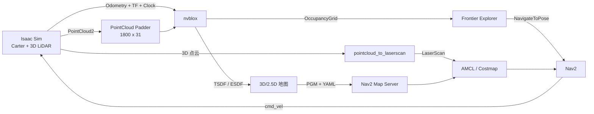

# Isaac 3D LiDAR AMR Workspace

基于 **NVIDIA Isaac Sim + ROS 2 Humble + Isaac ROS nvblox + Nav2** 的 3D LiDAR 移动机器人工作区，覆盖仓库场景仿真、2.5D 建图、地图保存与加载、定位导航，以及基于前沿的自动探索。

本仓库包含一套已经验证的 `warehouse_v3` 示例：3D LiDAR 点云经预处理后进入 nvblox，生成 ESDF/TSDF 与二维占用栅格；Nav2 使用导出的 PGM/YAML 地图完成路径规划和运动控制。

> 当前项目面向已有 Isaac Sim、Isaac ROS 和 ROS 2 Humble 容器环境的开发者，并不是开箱即用的单容器镜像。开始前请先阅读[环境要求](#环境要求)和[当前限制](#当前限制)。

## 功能

- Isaac Sim 仓库场景与 Carter AMR 仿真
- Hesai XT32 风格 3D LiDAR 点云接入
- 点云固定尺寸填充，适配 nvblox 球面 LiDAR range image
- nvblox TSDF/ESDF 与 2.5D OccupancyGrid 建图
- `.nvblx`、`.ply`、`.pgm`、`.yaml` 地图产物
- Nav2 全局规划、局部避障与速度平滑
- `ground_truth` 与 AMCL 两种定位模式
- 默认带运动互锁的 Frontier Exploration
- RViz 配置和已验证的 `warehouse_v3` 地图

## 系统链路



核心数据接口：

| 类型 | 话题 / 坐标系 |
| --- | --- |
| 原始 3D 点云 | `/front_3d_lidar/lidar_points` |
| nvblox 输入点云 | `/front_3d_lidar/lidar_points_nvblox` |
| 仿真里程计 | `/chassis/odom` |
| Nav2 里程计 | `/odom` |
| 实时二维地图 | `/nvblox_node/static_occupancy_grid` |
| 导航激光扫描 | `/scan` |
| 速度控制 | `/cmd_vel` |
| TF 链 | `map -> odom -> base_link -> front_3d_lidar` |

## 环境要求

- Ubuntu 主机、NVIDIA GPU 与可用的 NVIDIA 驱动
- Docker 与 NVIDIA Container Toolkit
- Isaac Sim 容器（项目中使用名称 `isaac-sim`）
- Isaac ROS / nvblox 容器（项目中使用名称 `isaac-ros-nvblox`）
- ROS 2 Humble / Nav2 容器（项目中使用名称 `ros2-dev-humble`）
- Cyclone DDS，以及三个容器之间一致的 DDS 配置和 `ROS_DOMAIN_ID`

工作区需要在三个容器中挂载到以下路径：

```text
/workspace/ros-humble/isaac_3d_lidar_amr_ws
```

推荐先确认容器都在运行：

```bash
docker ps --format '{{.Names}}\t{{.Status}}'
```

## 获取与构建

```bash
git clone https://github.com/shenfangqi/isaac-3d-lidar-amr-ws.git \
  isaac_3d_lidar_amr_ws
cd isaac_3d_lidar_amr_ws
```

在 Isaac ROS / nvblox 容器中构建 bringup 包：

```bash
cd /workspace/ros-humble/isaac_3d_lidar_amr_ws
source /workspaces/isaac_ros-dev/install/setup.bash
colcon build --symlink-install \
  --packages-select isaac_3d_lidar_bringup
```

在 ROS 2 Humble / Nav2 容器中构建探索包：

```bash
cd /workspace/ros-humble/isaac_3d_lidar_amr_ws
source /opt/ros/humble/setup.bash
colcon build --symlink-install \
  --packages-select isaac_3d_lidar_exploration
source install/setup.bash
```

`isaac_3d_lidar_bringup` 依赖 `nvblox_ros`，因此需要在已安装 Isaac ROS nvblox 的环境中构建。探索包依赖 Nav2、`pointcloud_to_laserscan`、`topic_tools` 和常用 ROS 2 消息包。两个容器应挂载同一个工作区，才能共享构建产物。

## 快速开始：加载示例地图并导航

以下命令分别在三个终端 / 容器中执行。启动顺序为 **Isaac Sim → nvblox → Nav2**。

### 1. 启动 Isaac Sim

```bash
docker exec -it isaac-sim bash
cd /isaac-sim

export isaac_sim_package_path=/isaac-sim
export RMW_IMPLEMENTATION=rmw_cyclonedds_cpp
export CYCLONEDDS_URI=file:///workspace/ros-humble/cyclonedds_ros_local.xml
export LD_LIBRARY_PATH="$LD_LIBRARY_PATH:$isaac_sim_package_path/exts/isaacsim.ros2.bridge/humble/lib"
export ROS_DOMAIN_ID=0

./python.sh \
  /workspace/ros-humble/isaac_3d_lidar_amr_ws/isaac_sim/auto_play_warehouse.py
```

### 2. 启动 nvblox 并加载 `warehouse_v3`

```bash
docker exec -it -u admin isaac-ros-nvblox bash

export RMW_IMPLEMENTATION=rmw_cyclonedds_cpp
export CYCLONEDDS_URI=file:///workspace/ros-humble/cyclonedds_ros_local.xml
source /workspaces/isaac_ros-dev/install/setup.bash
source /workspace/ros-humble/isaac_3d_lidar_amr_ws/install/setup.bash

ros2 launch \
  /workspace/ros-humble/isaac_3d_lidar_amr_ws/launch/nvblox_with_map.launch.py
```

### 3. 启动 Nav2

```bash
docker exec -it ros2-dev-humble bash

source /opt/ros/humble/setup.bash
export RMW_IMPLEMENTATION=rmw_cyclonedds_cpp
export CYCLONEDDS_URI=file:///workspace/ros-humble/cyclonedds_ros_local.xml
source /workspace/ros-humble/isaac_3d_lidar_amr_ws/install/setup.bash

ros2 launch \
  /workspace/ros-humble/isaac_3d_lidar_amr_ws/launch/nav_stack.launch.py \
  localization_mode:=ground_truth
```

仿真地图与 Isaac odom 已对齐时，`ground_truth` 会发布静态 `map -> odom`，适合先验证地图、规划器和控制器。需要验证 AMCL 时改为：

```bash
ros2 launch \
  /workspace/ros-humble/isaac_3d_lidar_amr_ws/launch/nav_stack.launch.py \
  localization_mode:=amcl \
  amcl_initial_pose_mode:=odom_identity
```

随后在 ROS 2 Humble 容器中启动 RViz：

```bash
rviz2 -d \
  /workspace/ros-humble/isaac_3d_lidar_amr_ws/configs/rviz/3d_lidar_amr_ws_3.rviz \
  --ros-args -p use_sim_time:=true
```

确认地图、点云、Scan、TF 和 Costmap 对齐后，再使用 **2D Goal Pose** 发送导航目标。仓库中的 RViz 配置文件为 [`configs/rviz/3d_lidar_amr_ws_3.rviz`](configs/rviz/3d_lidar_amr_ws_3.rviz)。

完整的启动、验收和故障排查步骤见[保存地图与 Nav2 导航教程](docs/map_nav/README.md)。

## 新建地图与自动探索

新建地图时不要加载旧 `.nvblx`，只启动纯 nvblox：

```bash
ros2 launch isaac_3d_lidar_bringup xt32_nvblox.launch.py
```

确认 `/nvblox_node/static_occupancy_grid` 已产生有效的自由格和占用格后，可以手动遥控覆盖场景，或启动前沿探索：

```bash
ros2 launch isaac_3d_lidar_exploration explore_nvblox.launch.py \
  start_enabled:=false
```

探索默认不会自动运动。完成 RViz、TF、地图和代价地图检查，并确保没有其他 `/cmd_vel` 发布者后，显式启用：

```bash
ros2 service call /frontier_explorer/set_enabled \
  std_srvs/srv/SetBool "{data: true}"
```

随时暂停并取消当前目标：

```bash
ros2 service call /frontier_explorer/set_enabled \
  std_srvs/srv/SetBool "{data: false}"
```

详细流程：

- [nvblox 2.5D 建图、补图、保存与验证](docs/map_gen/README.md)
- [Frontier Exploration 使用与真机迁移](src/isaac_3d_lidar_exploration/README.md)

## 示例地图

仓库内保留了多个建图版本，其中 `warehouse_v3` 是当前导航配置默认使用并完成验证的版本：

| 产物 | 路径 | 用途 |
| --- | --- | --- |
| nvblox 原生地图 | `maps/nvblox/warehouse_v3.nvblx` | 恢复 TSDF/ESDF 地图 |
| 三维点云 | `maps/nvblox/warehouse_v3.ply` | 可视化和离线检查 |
| 二维栅格 | `maps/2d/warehouse_v3.pgm` | Nav2 静态地图 |
| 地图元数据 | `maps/2d/warehouse_v3.yaml` | 分辨率、原点与阈值 |

已验证基准：

```text
地图尺寸: 417 x 424
分辨率:   0.05 m/cell
原点:     [-14.4, -7.6, 0]
unknown:  117,570
free:     52,618
occupied: 6,620
```

`warehouse_v3.yaml` 的 `free_thresh` 为 `0.196`。不要随意改为 `0.25`，否则灰度值 205 的未知区域可能被误判为自由区域。

## 目录结构

```text
.
├── configs/                         # AMCL、Nav2 和 RViz 配置
├── docs/
│   ├── map_gen/                     # 建图、补图、保存与验证教程
│   └── map_nav/                     # 定位与导航教程
├── isaac_sim/                       # Isaac Sim 场景和自动播放脚本
├── launch/                          # 保存地图加载与 Nav2 总体启动文件
├── maps/
│   ├── 2d/                          # Nav2 PGM/YAML 地图
│   └── nvblox/                      # nvblox/PLY 地图
├── src/
│   ├── isaac_3d_lidar_bringup/      # 点云预处理与 nvblox bringup
│   ├── isaac_3d_lidar_exploration/  # 安全前沿探索节点
│   └── kiss-icp/                    # KISS-ICP 源码
└── skills/                          # 项目状态与环境调试知识
```

## 安全提示

- 同一时间只保留一个 `/cmd_vel` 控制源；自动探索和键盘遥控不要并行直连底盘。
- 真机首次运行前必须重新测量 footprint、膨胀半径、速度、加速度、制动距离和传感器盲区。
- nvblox 依赖稳定姿态，本身不提供大范围闭环；真机建图应配合低漂移 LiDAR/视觉惯性里程计或 SLAM。
- `ground_truth` 定位仅用于坐标已经对齐的仿真验证，不能代替真机定位。
- 自动探索默认 `start_enabled:=false`，请保留急停、底盘看门狗和独立碰撞保护。

## 当前限制

- `launch/` 与 Isaac Sim 脚本当前使用固定工作区路径 `/workspace/ros-humble/isaac_3d_lidar_amr_ws`；若挂载路径不同，需要同步修改相关文件。
- `docker/` 和 `scripts/` 目录当前是预留占位，尚未提供可复现的镜像构建与一键启动实现。
- 部分 USD 场景文件是占位文件；当前导航示例使用 `isaac_sim/usd/warehouse_3d_nav_origin_carter.usd`。
- 仓库根目录尚未提供统一的许可证文件；复用前请分别核对各组件许可证。

## 文档

- [建图教程](docs/map_gen/README.md)
- [导航教程](docs/map_nav/README.md)
- [自动探索说明](src/isaac_3d_lidar_exploration/README.md)
- [ROS / Docker 调试记录](skills/ros-docker-debug/SKILL.md)
- [项目状态记录](skills/isaac-amr-project-state/SKILL.md)
